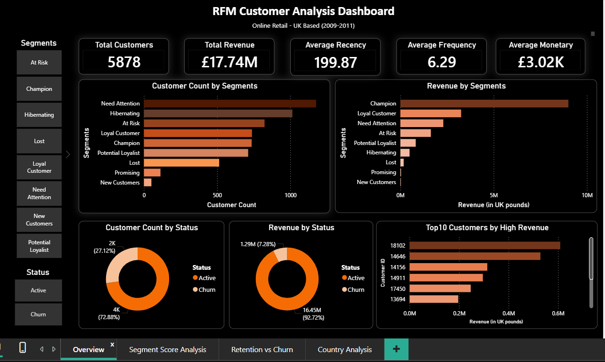
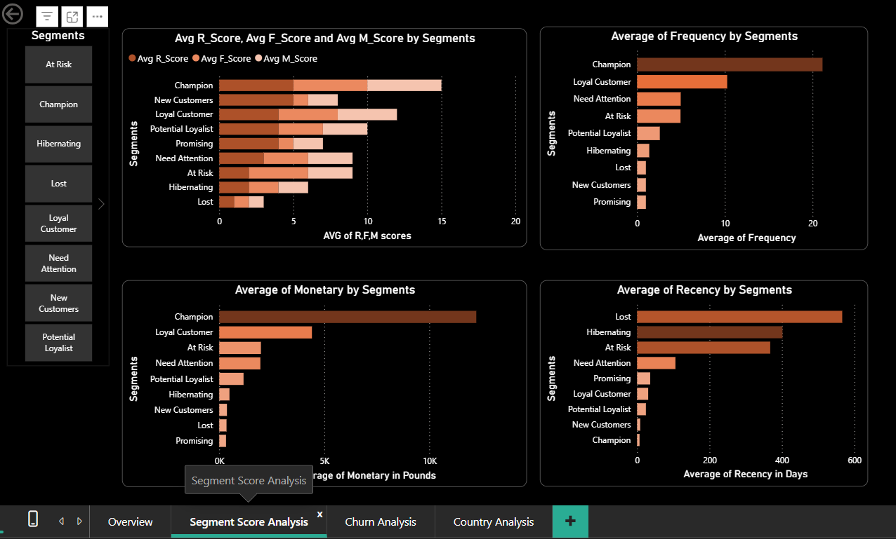

# 🛒 RFM Customer Segmentation Analysis
### Online Retail — UK Based Store | 2009–2011

---

## 📌 Project Overview

This project performs **RFM (Recency, Frequency, Monetary) Analysis** on a real-world online retail dataset to segment customers based on their purchasing behavior. The goal is to help businesses identify who their best customers are, who is at risk of leaving, and who has already been lost — so they can take targeted marketing and retention actions.

This project was built entirely using **MySQL, Microsoft Excel, and Power BI** — no Python or external ETL tools.

---

## 🎯 Business Problem

A UK-based online retail store wants to understand its customer base better. Instead of treating all customers the same, the business needs to:

- Identify **high-value customers** who deserve loyalty rewards
- Spot **at-risk customers** before they leave
- Recognize **lost customers** and decide whether re-engagement is worth the cost
- Understand **which countries** drive the most revenue
- Measure the **financial impact of customer churn**

---

## 📂 Dataset

| Detail | Info |
|---|---|
| **Source** | UCI Machine Learning Repository |
| **Dataset Name** | Online Retail II |
| **Link** | https://archive.ics.uci.edu/dataset/502/online+retail+ii |
| **Time Period** | December 2009 – December 2011 |
| **Records** | ~1 Million Rows |
| **Format** | Excel (.xlsx) — 2 sheets (one per year) |

### Key Columns Used

| Column | Description |
|---|---|
| `InvoiceNo` | Unique transaction ID (prefix 'C' = cancellation) |
| `InvoiceDate` | Date and time of transaction |
| `CustomerID` | Unique customer identifier |
| `Quantity` | Number of units purchased |
| `UnitPrice` | Price per unit in GBP (£) |
| `Country` | Country of the customer |

> **Note:** The `Description` column was excluded due to special character encoding issues (£ symbol). It was not required for RFM calculations.

---

## 🧠 What is RFM?

RFM is a customer segmentation technique based on three behavioral metrics:

| Metric | Question it Answers | Calculation |
|---|---|---|
| **Recency (R)** | How recently did the customer buy? | Days since last purchase |
| **Frequency (F)** | How often do they buy? | Count of unique invoices |
| **Monetary (M)** | How much do they spend? | Sum of (Quantity × UnitPrice) |

Each customer receives a score from **1 to 5** on each metric using NTILE(5) bucketing. These three scores are combined into an **RFM Score** (e.g., 555, 312, 111) which is then mapped to a **customer segment**.

---

## 🏷️ Customer Segments

| Segment | Description |
|---|---|
| **Champion** | Bought recently, buys often, spends the most |
| **Loyal Customer** | Regular buyers with high frequency and good spend |
| **Potential Loyalist** | Recent buyers with growing frequency |
| **New Customers** | Bought very recently but only once |
| **Promising** | Recent buyers but low frequency and spend |
| **Need Attention** | Above average metrics but not buying recently |
| **At Risk** | Used to buy frequently but haven't recently |
| **Hibernating** | Low recency, low frequency, low spend |
| **Lost** | Lowest recency — haven't purchased in a very long time |

---

## 🛠️ Tools Used

| Tool | Purpose |
|---|---|
| **MySQL Workbench** | Data cleaning, RFM calculation, scoring, segmentation, analysis queries |
| **Microsoft Excel** | Data validation, segment-level summaries |
| **Power BI Desktop** | Interactive dashboard with 4 pages, slicers, DAX measures |

---

## 🔄 Project Workflow

```
Raw Excel File
      │
      ▼
 Phase 1: SQL
 ─────────────────────────────
 → Import & Explore Raw Data
 → Clean Data (remove cancellations, nulls, negatives)
 → Calculate Recency, Frequency, Monetary per Customer
 → Score each metric using NTILE(5)
 → Combine scores → RFM Score
 → Map scores to Segment labels using CASE WHEN
 → Run analysis queries for business insights
      │
      ▼
 Phase 2: Excel
 ─────────────────────────────
 → Export cleaned RFM output
 → Build pivot tables by segment
 → Create supporting charts
 → Conditional formatting on score columns
      │
      ▼
 Phase 3: Power BI
 ─────────────────────────────
 → Connect to MySQL
 → Build DAX measures
 → Design 4-page interactive dashboard
 → Add slicers for Segment and Status filtering
```

---

## 🗄️ Phase 1 — SQL

### Data Cleaning Steps

- Removed cancelled invoices (InvoiceNo starting with 'C')
- Removed rows with NULL CustomerID
- Removed rows where Quantity ≤ 0 or UnitPrice ≤ 0
- Created a Revenue column: `Quantity × UnitPrice`

### RFM Calculation Logic

```
Reference Date = MAX(InvoiceDate) + 1 day

Recency  = Reference Date - MAX(InvoiceDate) per Customer
Frequency = COUNT(DISTINCT InvoiceNo) per Customer
Monetary  = SUM(Quantity × UnitPrice) per Customer
```

### Scoring Logic

- Used `NTILE(5)` window function to split customers into 5 equal buckets
- Recency scoring is **reversed** — lower days = score 5 (more recent = better)
- Frequency and Monetary — higher value = higher score

### Key SQL Analysis Queries

- Customer count and revenue by segment
- Average R, F, M per segment
- Active vs Churn customer distribution
- Revenue at risk from churn segments
- Top 10 customers by revenue
- Country-wise customer and revenue distribution
- Segment-wise percentage contribution to total revenue

---

## 📊 Phase 2 — Excel

### Sheet Structure

| Sheet | Content |
|---|---|
| Segmented Table | One row per customer with all scores,values and segments |
| Segment Analysis | Average of all scores, Customer count and %,Revenue per segment |
| Top 10 Customers by Revenue | List of top 10 customers with high revenue |
| Country Analysis | Customer and revenue breakdown by country |
| Churn vs Active | Customer count and revenue of those who are likely churn and who are active |
| Key Insights | Summary of major findings |

---

## 📈 Phase 3 — Power BI Dashboard

### Dashboard Pages

**Page 1 — Overview**
- KPI Cards: Total Customers, Total Revenue, Avg Recency, Avg Frequency, Avg Monetary
- Customer Count by Segment (horizontal bar chart)
- Revenue by Segment (horizontal bar chart)
- Customer Count by Status — Active vs Churn (donut chart)
- Revenue by Status (donut chart)
- Top 10 Customers by Revenue (bar chart)


**Page 2 — Segment Score Analysis**
- Avg R, F, M Scores by Segment (grouped bar chart)
- Average Frequency by Segment
- Average Monetary by Segment
- Average Recency by Segment

**Page 3 — Churn Analysis**
- KPI Cards: Churn Customer Count, Churn Revenue, Churn Segment Count, Revenue by Churn Segments
- Customer Count by Churn Segments (At Risk, Hibernating, Lost)
- Revenue by Churn Segments
- Avg Frequency by Churn Segments
- Avg Recency by Churn Segments

**Page 4 — Country Analysis**
- Customer Count by Country (map visual)
- Top 10 Countries by Customer Count (bar chart)
- Top 10 Countries by Revenue (bar chart)

### DAX Measures Created

| Measure | Purpose |
|---|---|
| `Total Customers` | DISTINCTCOUNT of CustomerID |
| `Total Revenue` | SUM of Monetary |
| `Average Recency` | AVERAGE of Recency column |
| `Average Frequency` | AVERAGE of Frequency column |
| `Average Monetary` | AVERAGE of Monetary column |
| `Retention Revenue` | Revenue of Champions and loyal customers |
| `Retention Customer Count` | Customer count of Champions and Loyal Customers |
| `Churn Customer Count` | CALCULATE filtered to churn segments |
| `Churn Revenue` | CALCULATE revenue for churn segments |
| `Champion %` | Champions / Total Customers × 100 |

### Slicers

- **Segment** slicer — filters all visuals on Overview, Segment Score Analysis, and Churn Analysis pages
- **Status** slicer (Active / Churn) — additional filter on Overview page

---

## 💡 Key Insights

### Customer Distribution
1. **"Need Attention" is the largest segment** with 1,000+ customers — the single biggest opportunity for re-engagement campaigns
2. **Hibernating and At Risk together form the second and third largest groups** — a significant portion of the customer base is already disengaging
3. **Champions and Loyal Customers combined represent a smaller but highly valuable group** — proving that the top-spending customers are always a minority
4. **New Customers and Promising segments are the smallest** — indicating the business acquires new customers slowly, making retention of existing ones even more critical
5. **Out of 6K total customers, 4K (72.88%) are Active and 2K (27.12%) are Churn** — nearly 1 in 3 customers has already stopped purchasing

### Revenue Distribution
6. **Total revenue stands at £17.74M** across the full period — Champions alone account for the largest share of this, close to £9M+
7. **Active customers generate £16.45M (92.72%) of total revenue** — meaning the business is heavily dependent on its active base staying engaged
8. **Churn segments (At Risk, Hibernating, Lost) represent £1.29M (7.28%) in lost or at-risk revenue** — At Risk alone holds the highest revenue among churn groups at nearly £2M, making it the highest priority for win-back efforts
9. **Loyal Customers are the second highest revenue segment** after Champions — rewarding and retaining them should be a top business priority
10. **United Kingdom dominates revenue at ~£15M** — international markets like EIRE, Netherlands, and Germany contribute but remain a very small fraction of total business revenue

---

## 📁 Repository Structure

```
rfm-customer-segmentation/
│
├── SQL/
│   ├── 01_data_exploration.sql
│   ├── 02_data_cleaning.sql
│   ├── 03_rfm_calculation.sql
│   ├── 04_rfm_scoring.sql
│   ├── 05_segmentation.sql
│   └── 06_analysis_queries.sql
│
├── Excel/
│   └── RFM_Analysis.xlsx
│
├── PowerBI/
│   └── RFM_Dashboard.pbix
│
├── Screenshots/
│   ├── page1_overview.png
│   ├── page2_segment_analysis.png
│   ├── page3_churn_analysis.png
│   └── page4_country_analysis.png
│
└── README.md
```

---

## 🚧 Challenges Faced

| Challenge | How It Was Resolved |
|---|---|
| Date format mismatch during MySQL import | Reformatted InvoiceDate column to `YYYY-MM-DD HH:MM:SS` in Excel before saving as CSV |
| £ pound symbol causing import errors | Description column removed entirely as it was not needed for RFM calculations |
| Recency scoring direction | Reversed NTILE scoring — lower recency days = higher score (5) since recent = better |
| Country slicer not filtering map visual | Country page kept as standalone — map and bar charts tell the geographic story independently |

---

## 🔮 Future Improvements

- Rebuild in **Python (Pandas)** for cleaner ETL and automated score calculation
- Add **time-series analysis** — how segments shift month over month
- Build a **customer lifetime value (CLV)** model on top of RFM scores
- Add **email campaign simulation** — estimated ROI per segment if re-engagement cost is known

---

## 👤 Author

**Mahima Tejesh Mandru**
Aspiring Data Analyst | SQL • Excel • Power BI

📧 [tejeshmm234@gmail.com@gmail.com]
🔗 [LinkedIn Profile URL]
🐙 [GitHub Profile URL]

---

## 📜 License

This project uses publicly available data from the UCI Machine Learning Repository for educational and portfolio purposes only.

---
